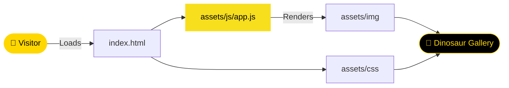

<div align="center">


[](https://git.io/typing-svg)

<br/>

<p align="center">
  <a href="https://github.com/NietoDeveloper">
    
  </a>
  <a href="https://committers.top/colombia#NietoDeveloper">
    
  </a>
  <a href="https://developer.mozilla.org/en-US/docs/Web/JavaScript">
    
  </a>
  <a href="https://pages.github.com/">
    
  </a>
  <a href="https://opensource.org/licenses/MIT">
    
  </a>
</p>

<p align="center">
  <a href="https://nietodeveloper.github.io/DinoImages/">
    
  </a>
  <a href="https://github.com/NietoDeveloper/DinoImages">
    
  </a>
</p>

</div>

---

## 📋 Overview

Welcome! This site serves as an **Images Dinosaurs Website**. A simple, lightweight website built with **vanilla JavaScript**, **CSS**, and **HTML**. No frameworks or dependencies required.

---

## 🗂️ Project Structure

```text
DinoImages/
├── assets/
│   ├── css/          # Stylesheets
│   ├── img/            # Dinosaur images
│   └── js/               # JavaScript logic
├── build/                  # Production build output
└── src/                      # Source files
```

---

## 🔄 Page Rendering Flow



---

## 🛠️ Technologies Used

<div align="center">

| Layer | Technologies |
|:------|:-------------|
| 🎨 **Frontend** | HTML, CSS, JavaScript |
| ☁️ **Hosting** | GitHub Pages |

</div>

---

## ✨ Features

- **Responsive Design:** Adapts cleanly across devices.
- **Interactive UI:** Powered entirely by vanilla JS.
- **Clean, Modular CSS Styling:** Organized under `assets/css`.
- **Standard HTML Structure:** No build tools required.

---

## 🚀 Setup Instructions

To set up the project locally, follow these steps:

**Step 1 — Clone the repository**

```bash
git clone https://github.com/NietoDeveloper/DinoImages
```

**Step 2 — Open `index.html`** in a web browser.

---

## 📖 Usage

- Navigate through the website using the browser.
- All functionality is handled by vanilla JS scripts in the `assets/js/` folder.
- Styles are located in the `assets/css/` folder.

---

## 🤝 Contributing

1. Fork the repository.
2. Create a feature branch (`git checkout -b feature-branch`).
3. Commit changes (`git commit -m 'Add feature'`).
4. Push to the branch (`git push origin feature-branch`).
5. Open a pull request.

---

## 👨‍💻 Author

**Manuel Nieto (NietoDeveloper)**

---

## 📄 License

MIT License. See [LICENSE](./LICENSE) for details.

<div align="center">

<br/>


</div>
